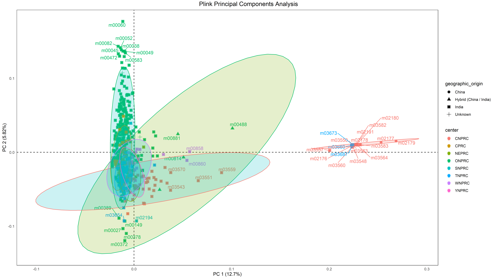
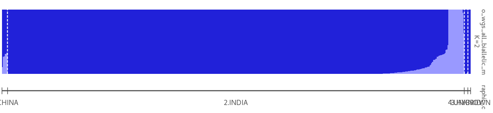
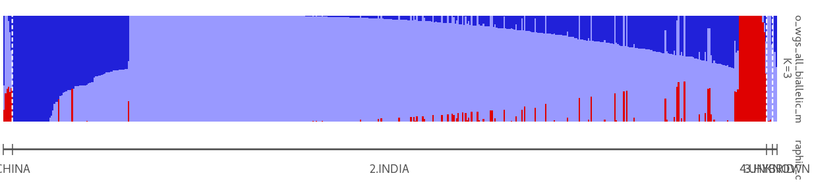
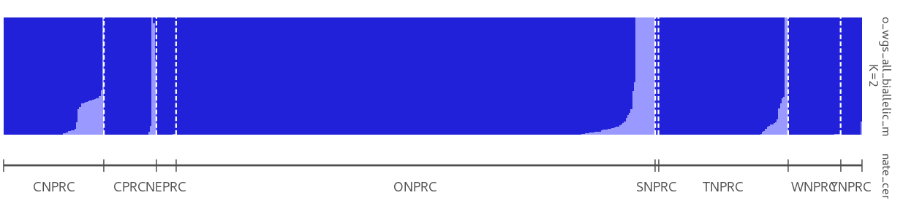
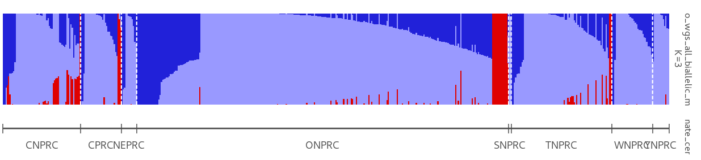

```{r setup, include = FALSE}
knitr::opts_chunk$set(echo = TRUE, collapse = TRUE, comment = "#>")
```

## What is fastStructure?

fastStructure is an algorithm for inferring population structure from large SNP genotype data. It is based on a variational Bayesian framework for posterior inference and was initially written in Python2.x. We have converted fastStructure to Python 3 (can be found in [this repo](https://github.com/vallenderlab/fastStructure)). 

### Input Data

fastStructure requires biallelic data and WGS only data. It also poses some complications in that the input for the program needs to be in a very specific format that is poorly documented. Also, given the computational intensiveness of fastStructure, the size of the resulting data file should be limited if possible.

To prepare the vcf for fastStructure, only WGS, autosomal chromosomes, biallelic snps and indels, and a minor allele frequency of `>0.05` were used. 

In this analysis, all WGS samples (India, China, and Hybrid) were included.

```{bash, eval=FALSE}
DATA_DIR=/ddn/home3/vallender/projects/NPRC_Pedigree_Project/data

INFILE=${DATA_DIR}/mGAP/all_nprcs_rminfo.vcf.gz
OUTFILE=${DATA_DIR}/structure_input/all_auto_wgs_biallelic_maf05.vcf.gz
CHROMOSOMES=chr01,chr02,chr03,chr04,chr05,chr06,chr07,chr08,chr09,chr10,chr11,
chr12,chr13,chr14,chr15,chr16,chr17,chr18,chr19,chr20,chrUn,MT
SAMPLES_FILE=/ddn/home3/vallender/projects/NPRC_Pedigree_Project/data/metadata/wgs_ids.txt

module use /ddn/home3/vallender/software/module_files
module load nprc_project

# Biallelic, autosomes only, only wgs samples, maf > .05
bcftools view $INFILE -r $CHROMOSOMES -S $SAMPLES_FILE -m2 -M2 -v snps,indels -i 'MAF>0.05' -O z -o $OUTFILE --threads 80

bcftools index $OUTFILE --threads 80
```

In addition to preparing the vcf file, a file formatted for fastStructure must be created. Initially, this was being done using a perl script that was written by Dr. Vallender, but I have adapted (and am adapting) a python script (below) that works and will generate the input for fastStructure. The output file is `all_auto_wgs_all_biallelic_maf05.str`.

```{python, eval=FALSE, python.reticulate=FALSE}
#!/usr/bin/env python3
from __future__ import print_function
import argparse
import sys
import os
import vcf  # pip install pyVCF


# parser
parser = argparse.ArgumentParser()  # add the parser
parser.add_argument("--input", help="input VCF file")  # add the parser
parser.add_argument(
    "--output", help="output STRUCTURE DATA file")  # add the parser

args = parser.parse_args()


def write_structure_file(outfile, snps, genotype_dict):
    print("Writing %s..." % outfile)
    with open(outfile, "w") as output:
        header = "#\t#\t#\t#\t#\t\Sample_ID"
        output.write("\t".join(snps) + "\n")
        for ind in genotype_dict.keys():
            output.write("\t".join([ind]+genotype_dict[ind]) + "\n")
    print("%s has been written." % outfile)


def import_vcf(infile):
    # open the vcf parser
    input_vcf = vcf.Reader(filename=infile, compressed=True,
                           prepend_chr="False", strict_whitespace=False)
    print('%s has been imported.' % infile)

    return input_vcf


def parse(vcf_obj):
    dict_alleles = {"0/0": "11", "0/1": "12",
                    "1/0": "12", "1/1": "22", "./.": "-9"}
    list_snps = []
    nsites = 0
    gen_dict = {ind: [] for ind in vcf_obj.samples}

    # store all the genotypes and loci names
    print("Creating genotype dictionary...")
    for site in vcf_obj:
        list_snps.append(site.CHROM + "_" + str(site.POS))
        for i in range(len(gen_dict.keys())):
            gen_dict[site.samples[i].sample].append(
                dict_alleles[site.samples[i]["GT"]])

    return list_snps, gen_dict


if __name__ == '__main__':
    vcf = import_vcf(infile=args.input)

    snps, genes = parse(vcf_obj=vcf)

    write_structure_file(outfile=args.output,
                         snps=snps, genotype_dict=genes)

```

Both scripts are located in `/ddn/home3/vallender/projects/NPRC_Pedigree_Project/src/fast_structure`. The output is located in `/ddn/home3/vallender/projects/NPRC_Pedigree_Project/data/structure_input`.

### Running fastStructure

Running fastStructure was quite a journey. With this dataset (all sites included), we needed to use catalpa and at least 225 GB of RAM. It took both the k1 and k2 population sizes about 16 hours to complete.  It took other datasets (because of the high number of iterations) over 30 hours to complete. The k10 run needed over 100 hours to complete which took roughly 10 gives given only so much RAM can be occupied by one user on catalpa.

```{bash, eval=FALSE}
#!/bin/bash
# ------------------------------------------------------------------
# [Vallender Lab] wgs_all
#          Run fast structure on all WGS samples.
#          ❗ This should be run on catalpa. ❗
#PBS -N faststruct
#PBS -l select=1:ncpus=1:mem=225gb
#PBS -l place=free
#PBS -j oe
#PBS -o logs/
#PBS -e logs/

FILENAME=all_auto_wgs_all_biallelic_maf05
NPRC_PROJECT=/ddn/home3/vallender/projects/NPRC_Pedigree_Project
INFILE=${NPRC_PROJECT}/data/structure_input/${FILENAME}
OUTDIR=${NPRC_PROJECT}/results/fast_structure/${FILENAME}
OUTFILE=${OUTDIR}/${FILENAME}
DISTRUCT_OUT=${OUTDIR}/${FILENAME}_k${K}_distruct.svg

FAST_STRUCT_DIR=/ddn/home3/vallender/software/fastStructure

# Load module files
module use /ddn/home3/vallender/software/module_files
module load nprc_project

# Export necessary libraries
export LD_LIBRARY_PATH=$LD_LIBRARY_PATH:/ddn/home3/vallender/software/gsl-2.4/lib
export CFLAGS="-I/ddn/home3/vallender/software/gsl-2.4/include"
export LDFLAGS="-L/ddn/home3/vallender/software/gsl-2.4/lib"

mkdir ${OUTDIR}

# Run fastStructure
python ${FAST_STRUCT_DIR}/structure.py -K ${K} --input=${INFILE} --output=${OUTFILE} --format=str --full --seed=100

# Visualizing admixture proportions
python ${FAST_STRUCT_DIR}/distruct.py -K ${K} --input=${OUTFILE} --output=${DISTRUCT_OUT}
```

### Results

We used the R package, [pophelper](https://github.com/royfrancis/pophelper), to help us visualize our data.

We also used plink's [PCA](https://www.cog-genomics.org/plink/1.9/strat) function to see if the data clustered as well.

This initial analysis was designed to see China vs India origin samples.


#### Plink PCA

Compared to the initial PCA performed on all WGS samples without any filtering of the minor allele frequency, this analysis (with filtering the snps using a maf `>0.05`) seems to more clearly separate India and China origin animals.




#### Pophelper Analysis

Below is the script used with pophelper.

```{r, eval=FALSE}
devtools::install_github('royfrancis/pophelper')
library(pophelper)

sfiles <- list.files(path=".", full.names=T)
slist <- readQ(files=sfiles)
tr1 <- tabulateQ(slist)
sr1 <- summariseQ(tr1)
slist1 <- alignK(slist)
md <- readr::read_csv("metadata.csv")
md <- data.frame(md)
for (i in 1:length(slist1)) {
  rownames(slist1[[i]]) <- md$mgap_id
  print(i)
}

smp_grp <- md[,1,drop=FALSE]
pmc_grp <- md[,2,drop=FALSE]
rownames(pmc_grp) <- md$mgap_id
go_grp <- md[,4,drop=FALSE]
rownames(go_grp) <- md$mgap_id
gen_grp <- md[,3,drop=FALSE]
rownames(gen_grp) <- md$mgap_id

plotQMultiline(slist1, returnplot=F, exportplot=T, sortind="all", spl=150, lpp=5, useindlab=T, indlabspacer=5, indlabsize=7, indlabangle=45, indlabvjust=1, grplab=pmc_grp, ordergrp=T, exportpath="~/fastStructure/", height=42, width=30, units="cm")

plotQ(slist, returnplot=F, exportplot=T, grplab=pmc_grp, sortind="all", ordergrp=T, outputfilename=c("pmc1", "pmc2", "pmc3", "pmc4", "pmc5", "pmc6", "pmc7"))
plotQ(slist, returnplot=F, exportplot=T, grplab=go_grp, sortind="all", ordergrp=T, outputfilename=c("go1", "go2", "go3", "go4", "go5", "go6", "go7"))
plotQ(slist, returnplot=F, exportplot=T, grplab=gen_grp, sortind="all", ordergrp=T, outputfilename=c("sex1", "sex2", "sex3", "sex4", "sex5", "sex6", "sex7"))

```

The script is located in `/ddn/home3/vallender/projects/NPRC_Pedigree_Project/results/fast_structure/all_auto_wgs_all_biallelic_maf05/pophelper_analysis`. 

Below are a few figures that were generated.












Additional figures are located on the MCSR in `/ddn/home3/vallender/projects/NPRC_Pedigree_Project/results/fast_structure/all_auto_wgs_all_biallelic_maf05/pophelper_analysis` on the MCSR.


### Discussion

Once the k gets to 3, fastStructure seems to struggle more with creating further populations. Additionally, the bigger the k, the longer the analysis. We have yet to run fastStructure's "choosek" script which will give us more knowledge on how many populations we have in this data. What we can see, however, is that the k2 population seems to be a split between China and India origin rhesus macaques. From this data, we can take a look at our PCA results and the mgap id's of the animals fitting a "China origin profile" in fastStructure to elimate those animals from downstream analyes.


#### Choosing Model Complexity

Based on [this discussion](https://groups.google.com/forum/#!topic/structure-software/s_rc_ueq6CU), the range of k should be 2 to 7 which ultimately means our data could be explained by any of those k values. The output of [chooseK](https://github.com/rajanil/fastStructure/blob/master/chooseK.py), a script part of fastStructure that parses through the output of the runs (k=1 to k=10) and provides a reasonable range of values for the model complexity appropriate for this dataset, is below.

```
Model complexity that maximizes marginal likelihood = 2
Model components used to explain structure in data = 7
```
